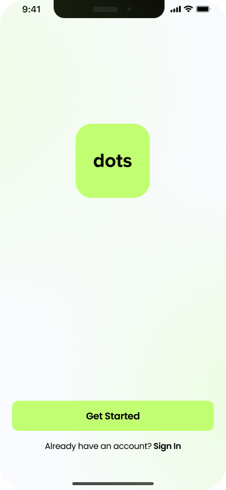
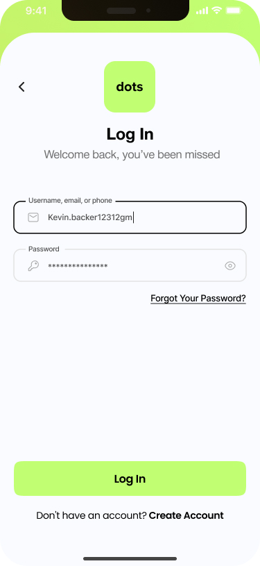
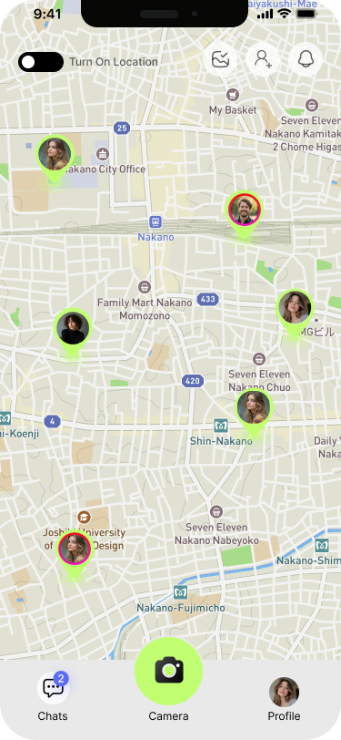
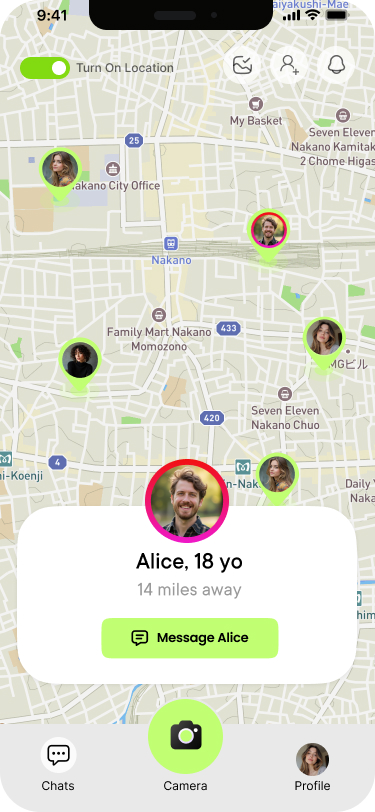
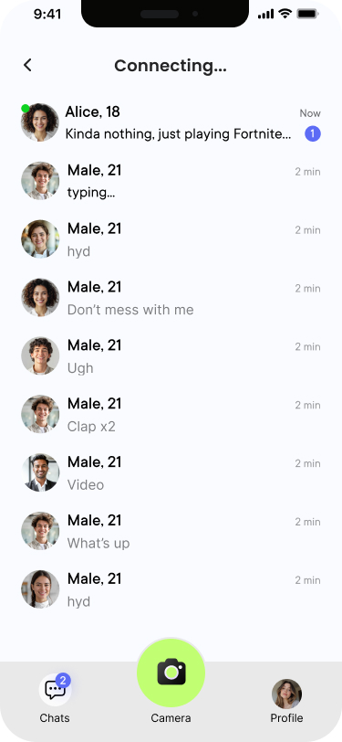
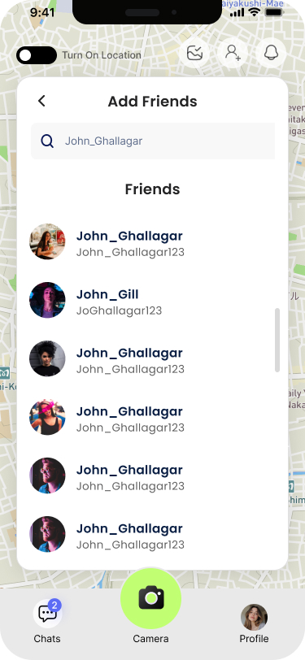
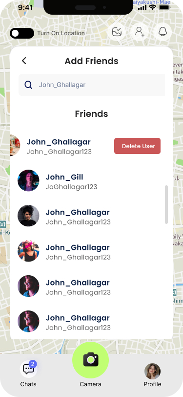
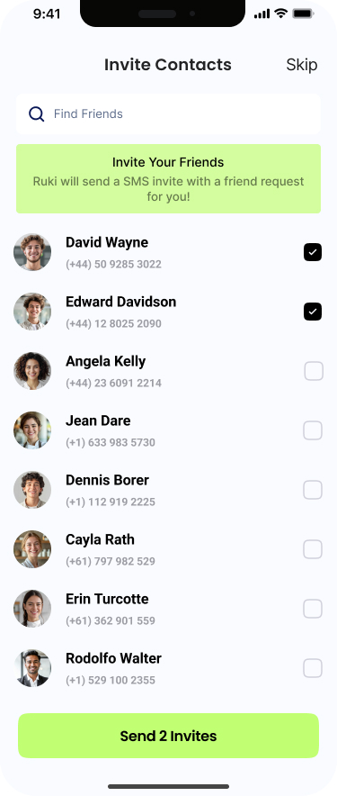
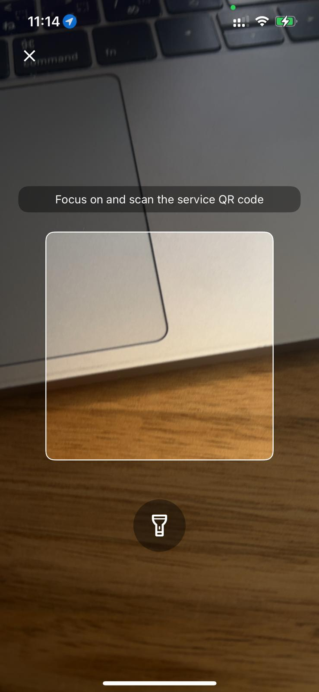

# Dots — Mobile App Frontend 📸


> **Backend Project Integration:** This frontend works in tandem with our fully developed backend API. You can find the backend repository here:
> 👉 **[Dots Backend](https://github.com/HaiGo/Dots_theBack)**

> **Booth Client Integration:** The physical photobooth hardware client can be found here:
> 👉 **[Dots Client](https://github.com/HaiGo/Dots_theBooth)**
---

## 🌟 Motivation

This project started as a freelance endeavor during my IT Master's studies at the École de Technologie Supérieure (ÉTS) in Montreal. Through online platforms (Fiverr and LinkedIn), I connected with an excited and eager entrepreneur from Japan. He calls himself Kai Ghribi, and he had a crazy but brilliant idea: to build a smart photobooth hardware/software solution for local businesses, such as restaurants and retail stores.

**The Original Idea:**
Install smart photobooths in stores. Customers can scan a QR code to control the booth from their phone, take pictures, have the store's custom stamp applied to their photos, and receive the memories via email.

**The Pivot to a Social Network:**
We realized that simply emailing photos was too limiting. Why ask users for their email just to send a picture? In Japan, the photobooth ("purikura") culture is highly developed, but we saw a gap in the market for a dedicated social platform, especially with the limited presence of alternatives like Snapchat.

We expanded the vision to create a full-fledged **social network** built around these photobooths. Users can not only capture memories but also share them, chat with friends, and interact with the businesses they visited. This creates a more convenient and engaging experience that encourages users to return to those stores frequently, driving business growth while providing an unforgettable user experience.

---

## 🚀 Objectives

The primary objective of this mobile application is to be the **user-facing interface** of the entire Dots ecosystem. It serves as the bridge between the user and:

1. **The Physical Photobooth** — Scan QR codes displayed on the booth, trigger photos remotely, and receive captured images in real-time.
2. **The Social Network** — Find friends via contacts or search, chat in real-time, share photos, and view friends on an interactive map.
3. **The Cloud Backend** — Authenticate, manage profiles, browse galleries, and apply custom frames to photos.

---

## 🏗️ Architecture & Technology Stack

This app is built with a modern, production-ready React Native stack using Expo's managed workflow with custom native modules.

| Layer | Technology | Purpose |
|---|---|---|
| **Framework** | React Native 0.81 + Expo SDK 54 | Cross-platform mobile development |
| **Language** | TypeScript 5.9 | Type-safe development |
| **Navigation** | Expo Router (file-based) | Tab & stack navigation |
| **Real-Time Chat** | TalkJS (@talkjs/expo) | Embeddable chat UI with push notifications |
| **Push Notifications** | Firebase Cloud Messaging (FCM) + APNs | Android & iOS push notifications |
| **Maps** | react-native-maps + Google Maps API | Interactive friend location map |
| **Camera** | expo-camera | QR code scanning |
| **Media** | expo-image-picker, expo-media-library | Photo capture, gallery, saving |
| **Storage** | expo-secure-store, AsyncStorage | Secure JWT token storage & local cache |
| **Image Processing** | react-native-view-shot | Photo frame overlay composition |
| **Background Services** | @notifee/react-native | Local notifications & background messaging |
| **Authentication** | JWT (via backend API) | Access & refresh token management |

---

## ✨ Key Functionalities

### 📍 Interactive Friend Map (Home Screen)
- Real-time map showing friends' locations (with privacy controls)
- Custom-styled Google Maps with branded markers
- Bottom sheet for friend list with quick actions (chat, view profile)
- Location sharing toggles (global, per-friend, granular privacy)
- Pull-to-refresh to update friend locations

### 💬 Real-Time Chat
- Full-featured chat powered by TalkJS (WebView-based)
- One-on-one messaging with friends
- Photo sharing directly within chat conversations
- Push notifications for new messages (Android via FCM, iOS via APNs)
- Notifications work even when the app is force-closed

### 📷 QR Code Scanner & Photo Capture
- Scan QR codes displayed on physical photobooths
- Remote camera triggering (sends command to Raspberry Pi via backend)
- Real-time photo delivery after booth captures the image
- Custom photo frames overlay system (birthday, wedding, corporate themes)

### 🖼️ Gallery & Photo Detail
- Browse all captured photos in a grid gallery
- Full-screen photo viewer with frame application
- Download photos to device gallery
- Share photos with friends via TalkJS chat

### 👥 Social Features
- Search users by username
- Find friends from phone contacts (E.164 format matching)
- Send/accept friend requests
- View friend profiles with profile pictures

### 👤 Profile Management
- Customizable profile with photo upload
- Username (userid) management
- Password change
- Location sharing privacy settings

---

## 📱 App Screens Overview

```
App
├── (auth)/                    # Authentication flow
│   ├── login.tsx              # Email + password login
│   ├── register.tsx           # Full registration with phone number
│   ├── verify-email.tsx       # Email verification screen
│   └── forgot-password.tsx    # Password reset flow
│
├── (tabs)/                    # Main tabbed interface
│   ├── index.tsx              # 📍 Map — Home screen with friend locations
│   ├── chat.tsx               # 💬 Chat — TalkJS chat inbox
│   ├── camera.tsx             # 📷 Camera — QR scanner for booth linking
│   └── profile.tsx            # 👤 Profile — User settings & info
│
├── gallery.tsx                # 🖼️ Photo gallery grid
├── photo-detail.tsx           # 🔍 Full-screen photo with frames
├── photo-capture.tsx          # 📸 Photo capture waiting screen
├── friends-list.tsx           # 👥 Friends management
├── find-contacts.tsx          # 📱 Find friends from phone contacts
├── search-users.tsx           # 🔎 Search users by username
└── change-password.tsx        # 🔑 Password change screen
```

## 📸 App Screenshots

<div style="display: flex; flex-wrap: wrap; gap: 10px;">
  
  
  
  
  
  
  
  
  
</div>

---

## 🔌 Backend API Integration

This app communicates with the Dots Backend API. Below is a high-level overview of the consumed endpoints. **For detailed request/response schemas, please refer to the [Backend Repository](https://github.com/HaiGo/Dots_theBack).**

### Authentication (`/auth`)
| Method | Endpoint | Description |
|---|---|---|
| `POST` | `/auth/register` | Create a new user account |
| `POST` | `/auth/login` | Authenticate and receive JWT tokens |
| `POST` | `/auth/forgot-password` | Initiate password reset via email |
| `GET` | `/auth/verify-email` | Verify email address |
| `POST` | `/auth/update-password` | Change user password |

### Mobile App Core (`/mobile`)
| Method | Endpoint | Description |
|---|---|---|
| `POST` | `/mobile/start-session` | Link to a booth via QR code session key |
| `POST` | `/mobile/trigger-photo` | Command the Pi to capture a photo |
| `GET` | `/mobile/gallery` | Retrieve the user's photo gallery |
| `POST` | `/mobile/upload-photo` | Upload a photo (with frame overlay) |

### Social Features (`/social`)
| Method | Endpoint | Description |
|---|---|---|
| `GET` | `/social/search-user` | Search users by username |
| `POST` | `/social/update-userid` | Update username |
| `POST` | `/social/update-location` | Update user location |
| `POST` | `/social/add-friend` | Send a friend request |
| `POST` | `/social/remove-friend` | Remove a friend |
| `GET` | `/social/friends` | Get friends list with locations |
| `POST` | `/social/find-by-phones` | Find users by phone numbers |
| `GET` | `/social/profile` | Get user profile |
| `PUT` | `/social/profile` | Update user profile |
| `POST` | `/social/upload-profile-picture` | Upload profile photo |
| `GET` | `/social/location-sharing-settings` | Get location privacy settings |
| `PUT` | `/social/location-sharing-settings` | Update location privacy |
| `POST` | `/social/share-location-with` | Share location with specific friend |
| `POST` | `/social/stop-sharing-location-with` | Stop sharing location with friend |

---

## 🛠️ Setup & Installation

### 1. Prerequisites

- **Node.js** 18+ and npm
- **Expo CLI**: `npm install -g expo-cli`
- **EAS CLI** (for native builds): `npm install -g eas-cli`
- A running instance of the [Dots Backend](https://github.com/HaiGo/Dots_theBack)
- **TalkJS Account** — [Sign up here](https://talkjs.com) for App ID and Secret Key
- **Google Maps API Key** — [Get one here](https://console.cloud.google.com/apis/credentials) (Maps SDK for Android/iOS)
- **Firebase Project** — [Create one here](https://console.firebase.google.com) for push notifications (FCM)

### 2. Clone & Install

```bash
git clone https://github.com/HaiGo/Dots_theFront.git
cd Dots_theFront

# Install dependencies
npm install
```

### 3. Environment Configuration

All sensitive configuration is driven by environment variables.

```bash
# Copy the template
cp .env.example .env
```

Open `.env` and fill in your values:

| Variable | Description | Where to Get It |
|---|---|---|
| `EXPO_PUBLIC_API_BASE_URL` | Your backend server URL | Your deployed Dots Backend URL |
| `EXPO_PUBLIC_TALKJS_APP_ID` | TalkJS Application ID | [TalkJS Dashboard](https://talkjs.com/dashboard) → Settings |
| `EXPO_PUBLIC_TALKJS_SECRET_KEY` | TalkJS Secret Key | [TalkJS Dashboard](https://talkjs.com/dashboard) → Settings → Keys |

### 4. Firebase Setup (Push Notifications)

For Android push notifications, you need a `google-services.json` file:

1. Go to [Firebase Console](https://console.firebase.google.com)
2. Create a project or select an existing one
3. Add an Android app with package name `com.dots.app`
4. Download `google-services.json` and place it in the project root
5. A template is provided: `google-services.example.json`

### 5. Google Maps Setup

For the interactive map feature, configure your Google Maps API keys in `app.json`:

```json
{
  "expo": {
    "ios": {
      "config": {
        "googleMapsApiKey": "YOUR_IOS_GOOGLE_MAPS_API_KEY"
      }
    },
    "android": {
      "config": {
        "googleMaps": {
          "apiKey": "YOUR_ANDROID_GOOGLE_MAPS_API_KEY"
        }
      }
    }
  }
}
```

### 6. EAS Configuration

Update `app.json` with your Expo account details:

```json
{
  "expo": {
    "extra": {
      "eas": {
        "projectId": "YOUR_EAS_PROJECT_ID"
      }
    },
    "owner": "YOUR_EXPO_ACCOUNT_NAME"
  }
}
```

### 7. Running the App

#### Development (Expo Go — limited features)
```bash
npx expo start
```

> **Note:** Some features like Firebase push notifications and TalkJS native modules require a development build. Expo Go has limited native module support.

#### Development Build (Full features)
```bash
# Build for Android
eas build --profile development --platform android

# Build for iOS
eas build --profile development --platform ios

# Start the dev server
npx expo start --dev-client
```

#### Production Build
```bash
# Build production APK for Android
eas build --profile production --platform android

# Build production IPA for iOS
eas build --profile production --platform ios
```

---

## 📐 Project Structure

```
dots-frontend/
├── app/                       # Screens (Expo Router file-based routing)
│   ├── (auth)/                # Authentication screens
│   ├── (tabs)/                # Main tab screens (Map, Chat, Camera, Profile)
│   ├── _layout.tsx            # Root layout with push notification setup
│   └── *.tsx                  # Additional screens (gallery, photo detail, etc.)
│
├── assets/                    # Static assets
│   ├── frames/                # Photo frame overlays (birthday, wedding, corporate)
│   ├── images/                # App icons, logos, UI assets
│   └── images0/               # Additional image assets
│
├── components/                # Reusable UI components
│   └── ui/                    # Base UI components
│
├── config/                    # App configuration
│   ├── api.ts                 # API endpoints, types, and response interfaces
│   ├── appConfig.ts           # App-level settings
│   └── talkjs-theme.css       # Custom TalkJS chat theme
│
├── constants/                 # App constants
│   └── theme.ts               # Color palette and design tokens
│
├── hooks/                     # Custom React hooks
│   └── use-color-scheme.ts    # Theme management
│
├── services/                  # API and external service integrations
│   ├── authService.ts         # Authentication (login, register, JWT management)
│   ├── socialService.ts       # Social features (friends, profiles, locations)
│   ├── photoService.ts        # Photo gallery and upload management
│   ├── frameService.ts        # Photo frame overlay system
│   ├── talkjsService.ts       # TalkJS REST API integration
│   ├── fcmTokenService.ts     # Firebase Cloud Messaging (Android)
│   └── apnsTokenService.ts    # Apple Push Notifications (iOS)
│
├── utils/                     # Utility functions
│   ├── apiErrorHandler.ts     # Centralized API error handling
│   ├── batteryOptimization.ts # Android battery optimization handling
│   ├── jwtUtils.ts            # JWT token parsing and refresh logic
│   └── platformUtils.ts       # Platform detection helpers
│
├── scripts/                   # Build and development scripts
│   ├── generate-frame-mappings.js  # Auto-generate frame asset mappings
│   └── reset-project.js       # Project reset utility
│
├── app.json                   # Expo configuration
├── eas.json                   # EAS Build configuration
├── package.json               # Dependencies and scripts
├── tsconfig.json              # TypeScript configuration
├── babel.config.js            # Babel configuration
├── .env.example               # Environment variable template
└── google-services.example.json  # Firebase config template
```

---

## 🔗 Related Repositories

| Repository | Description | Link |
|---|---|---|
| **Backend API** | Flask backend with PostgreSQL, Redis, MinIO | [Dots_theBack](https://github.com/HaiGo/Dots_theBack) |
| **Booth Client** | Raspberry Pi photobooth hardware controller | [Dots_theBooth](https://github.com/HaiGo/Dots_theBooth) |
| **Frontend App** | This repository — React Native mobile app | [Dots_theFront](https://github.com/HaiGo/Dots_theFront) |

---

*Developed with passion and excitement to put the “vibe-coded” slogan to the test, while hoping to bring people together.* ✨

These are the only human-written words in this whole project, and I’m using it to say: this is a fully vibe-coded project, in its entirety, including the two other parts of it. It’s not recommended for any kind of production use as it is, negligible, if not to say zero, security precautions were taken during its vibe coding. But please, feel free to enjoy "vibe-improving" it while WE CONNECT TOGATHER!